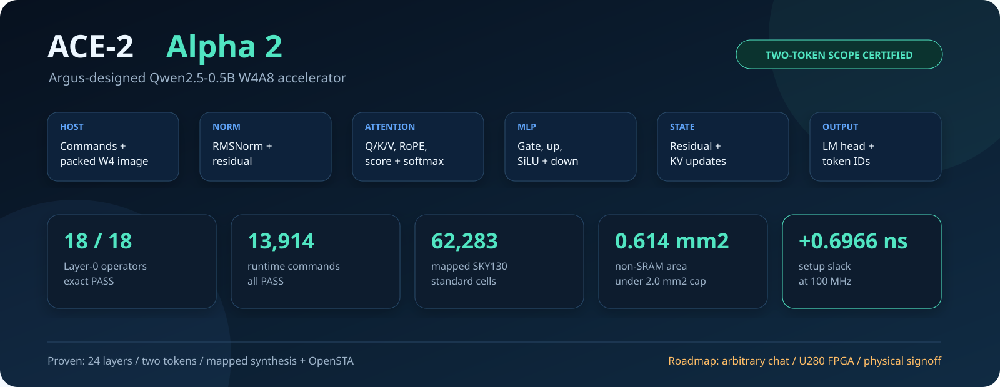

# Argus Compute Engine 2 (ACE-2)

[](https://github.com/aHappend/ace-2/releases)
[](LICENSE)
[](rtl/)
[](docs/PPA_SUMMARY.md)

**An evidence-driven Qwen2.5-0.5B W4A8 accelerator designed and iterated by
[Argus](https://argusbot.cn/).**



> **Alpha 3 scope:** a public productization-progress snapshot built on the
> unchanged Alpha 2 certified RTL baseline. It documents the post-Alpha-2 BF16
> model-quality program and the exact gates that still block arbitrary-text
> W4A8 chat and U280 deployment. Alpha 3 does not claim a new certified model,
> general chat, FPGA execution, routed signoff, or silicon.

## Alpha 3 at a glance

| Area | Alpha 3 status |
|---|---|
| Certified RTL baseline | **Preserved unchanged from Alpha 2** |
| Layer-0 fixed-point operators | **18 / 18 exact PASS** |
| Full runtime commands | **13,914 / 13,914 PASS** |
| Demonstrated model path | **24 layers, two generated tokens** |
| SKY130 mapped result | **62,283 cells, 0.614082704 mm2** |
| Timing | **100 MHz PASS, +0.6966 ns setup slack** |
| BF16 successor | **S6 sealed at probe-gate NO-GO; official dev was not accessed** |
| Arbitrary-text W4A8 chat | **Not yet accepted** |
| Alveo U280 deployment | **Not started; external tool/board access required** |

The machine-readable identities, model revision, image hash, schedule hash,
and exact Alpha 2 certification boundary remain summarized in
[CERTIFICATION.md](CERTIFICATION.md). See
[Alpha 3 productization progress](docs/ALPHA3_PROGRESS.md) for the new work and
its explicit non-claims.

## What ACE-2 contains

```mermaid
flowchart LR
    H[Host command stream] --> D[Descriptor + DMA shell]
    D --> N[RMSNorm]
    N --> Q[W4A8 Q / K / V / O projections]
    Q --> R[RoPE + attention score]
    R --> S[Softmax + value composition]
    S --> M[MLP gate / up / SiLU / down]
    M --> A[Residual + KV state]
    A --> L[Final RMSNorm + LM head]
    L --> T[Token IDs]
```



The release includes the certified RTL, deterministic fixed-point references,
generated test vectors, Verilator/Icarus harnesses, image/runtime utilities,
and release-local SKY130 flow scripts. Model weights, proprietary PDK data,
private benchmarks, build products, and sealed internal run packets are not
distributed.

## Run the visual demo

Install Python 3, GNU Make, Verilator, and Icarus Verilog, then run:

```sh
make demo
```

The demo does not replay the billion-cycle full-model certification. It runs a
fast, public-safe evidence chain:

1. verifies every certified RTL file hash;
2. checks the open-source toolchain;
3. lints the complete accelerator shell;
4. regenerates deterministic RMSNorm vectors with the independent oracle;
5. simulates 15 RTL cases x 56 beats against expected results;
6. produces a standalone visual evidence dashboard.

Expected final marker:

```text
ACE2_ALPHA2_DEMO_PASS
```

Open the generated dashboard:

```text
build/DEMO_REPORT.html
```

**[View a sample Alpha 2 evidence report](docs/DEMO_REPORT.md)** without
installing the simulation toolchain.

See [DEMO.md](DEMO.md) for the complete walkthrough and raw artifact map.

## Engineering progression

ACE-2 reached timing closure through measured, tree-specific iterations rather
than by hiding failed candidates:

| RTL frontier | Setup slack | Result |
|---|---:|---|
| Initial complete runtime tree | -0.1484 ns | NO-GO |
| Low-fanout shell control repair | -0.5275 ns | NO-GO |
| RMSNorm capture-enable repair | -0.1741 ns | NO-GO |
| RMSNorm final-sum preload split | **+0.6966 ns** | **100 MHz PASS** |

The final split introduces `ST_MEAN_PRELOAD`, separating the 48-bit final
sum-of-squares carry from dividend loading. The exact final tree is bound by
[CERTIFIED_RTL.sha256](CERTIFIED_RTL.sha256).

## What is proven, and what is not

**Proven and carried forward unchanged from Alpha 2**

- all 18 Layer-0 operator boundaries;
- 13,914-command, 24-layer, two-token RTL execution;
- exact model/image/schedule identities;
- mapped SKY130 100 MHz and 2.0 mm2 area-cap compliance;
- independent Fresh Reviewer certification.

**Not yet claimed**

- arbitrary natural-language conversation or unrestricted generation;
- stable tokenizer, host, or deployment API;
- FPGA emulation, bitstream, or board execution;
- routed timing, power signoff, DRC/LVS, GDS, tapeout, or silicon.

See [KNOWN_LIMITATIONS.md](KNOWN_LIMITATIONS.md) for the full list.

## Productization path

- **Current gate:** design and independently review a new BF16 successor after
  S6 failed closed at probe lock. S6 may not be retried, resumed, or rescored.
- **After that:** arbitrary-text prefill, KV reuse, readable multi-token
  decoding, quantized-reference/RTL agreement, and a one-command local chat
  demo.
- **Then:** AMD/Xilinx Alveo U280 PCIe/XRT + HBM2 integration and emulation.
- **Later:** board validation and physical-design signoff.

Productization work is not part of the certified baseline until it receives
reproducible evidence and an independent Fresh Reviewer verdict.

## Repository map

```text
rtl/                  Certified synthesizable RTL
constraints/          Release-local timing constraints
flow/                 SKY130 synthesis/STA scripts
verification/         Deterministic vectors, tests, and runtime harnesses
tools/                Fixed-point references and image/runtime utilities
docs/                 Architecture, PPA, and traceability summaries
CERTIFIED_RTL.sha256  Exact certified RTL manifest
CERTIFICATION.md      Evidence identities and claim boundary
CHANGELOG.md          Version history
```

## Versions

- [`v0.3.0-alpha.1`](../../releases/tag/v0.3.0-alpha.1) — **ACE-2 Alpha 3**,
  productization progress with the certified Alpha 2 baseline preserved.
- [`v0.2.0-alpha.1`](../../releases/tag/v0.2.0-alpha.1) — **ACE-2 Alpha 2**,
  certified two-token RTL snapshot.
- [`v0.1.0-alpha.1`](../../releases/tag/v0.1.0-alpha.1) — **ACE-2 Alpha 1**,
  accepted prefix through `layer_0.v_proj`.

Tags preserve previous snapshots; `main` describes the latest version.

## License

Licensed under the [Apache License 2.0](LICENSE). The license applies to ACE-2
source, tools, and documentation in this repository, including preserved
historical versions, unless a file explicitly states otherwise.
